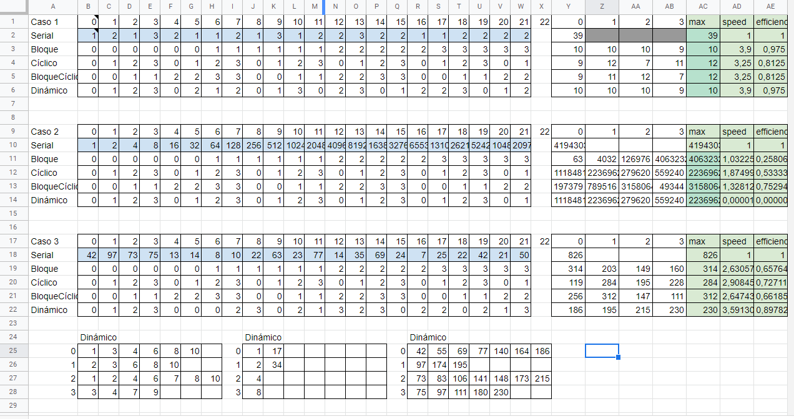

### Ejemplos de diversos mapeos del tema 14

## Mapeo hecho en excel por Jeisson

# Mapeo Bloque`

El mapeo estático por bloque asigna rangos continuos de trabajo a cada trabajador. Es el mapeo que potencialmente puede disminuir más fallos de caché o false sharing si se trabaja con memoria continua. El bloque de un trabajador i está dado por el rango de índices enteros [start,finish[, donde start y finish son funciones dadas por:

`start(i,D,w)=i⌊Dw⌋+min(i,mod(D,w))`

`finish(i,D,w)=start(i + 1,D,w)`

donde i es el número del trabajador (iniciando en 0), D es la cantidad de datos, y w es la cantidad total de trabajadores.

# Mapeo Ciclico

El mapeo estático cíclico asigna al trabajador i todas las unidades de trabajo con índice `{i,i+w,i+2w,...}`. Puede tener ventajas cuando las unidades de datos presentan algún patrón predecible y que no es apto para el mapeo por bloque. Se puede hacer un híbrido del mapeo cíclico por bloque que reparte no una unidad, sino bloques de unidades de trabajo de igual tamaño de forma cíclica a cada trabajador.

# Mapeo Dinamico

Los algoritmos de mapeo dinámico reparten las unidades de descomposición entre los ejecutantes en tiempo de ejecución. Un principio de diseño que puede seguirse es "cuando un ejecutante se desocupa toma la siguiente unidad de trabajo disponible". Este principio puede implementarse de formas como las siguientes:

`Variable de control`. Una variable compartida y protegida por exclusión mutua que indica cuál es la próxima unidad de trabajo disponible. Cuando un ejecutante se desocupa, compite por el mutex y cuando lo adquiere, toma la siguiente unidad de trabajo disponible y deja en la variable compartida la unidad que le sigue. Esto se repite hasta que los ejecutantes hayan completado todo el trabajo.

`Productor-consumidor`. El trabajo se agrega, normalmente por el hilo principal a un buffer (por ejemplo, una cola thread-safe) llamado work pool. Los ejecutantes consumen del buffer y procesan cada unidad de trabajo que extraen. Se debe decidir la forma de detener los consumidores, como usar variables contadoras, cuando el buffer está vacío, o cuando se extrae un valor centinela.

`Mapeo dinámico aleatorio`. En caso de paso de mensajes o de uso del patrón productor-consumidor, el productor de trabajo lo reparte de forma aleatoria entre los ejecutantes (consumidores).

# Imagen del cuadro con los diversos tipos de mapeos y su eficiencia y velocidad

