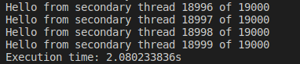
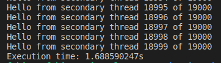

### Semaphores_vs_Conditional_Safe

## Discusion sobre el ejercicio 16 

Ejecute al menos tres veces los códigos de ***Ejemplo 7*** (imprimir en orden con semáforos) y ***Ejemplo 8*** (imprimir en orden con seguridad condicional) con tantos hilos como su sistema operativo permite. Reporte en su readme.md las tres duraciones de cada solución. Tome la menor duración de las tres corridas de cada versión. **¿Cuál solución realiza su trabajo en menor tiempo?** Discuta en máximo un párrafo cuál podría ser la causa de este comportamiento.

**Semaforo: 19000 hilos ->  De 2.0 a 2.5 segundos de duracion**

**Conditionanl safe: 19000 hilos - >De 1.60 a 2.0 segundos de duracion**

***[Discusion de resultados del ejercicio 16]***

`Como se puede observar en las imagenes anteriores, el que mas dura es el codigo del semaforo mientras que el que menos dura por poco es el codigo del conditional_safe, esto puedeestar ligado a que el semaforo tiene una mayor cantidad de procesos como es el init, destroy, wait, signal que probablemente no consuman mucho tiempo pero puede que consuman mas que trabajar en una parte de la memoria dieferente como lo hace el conditional_safe. Por lo tanto, el que menos tiempo dura es el conditional_safe pero el semaforo tiene una mayor cantidad de procesos y herramientas que pueden ayudar al programador a la hora de crear su codigo y darle un toque mas elegante y sencillo de leer`