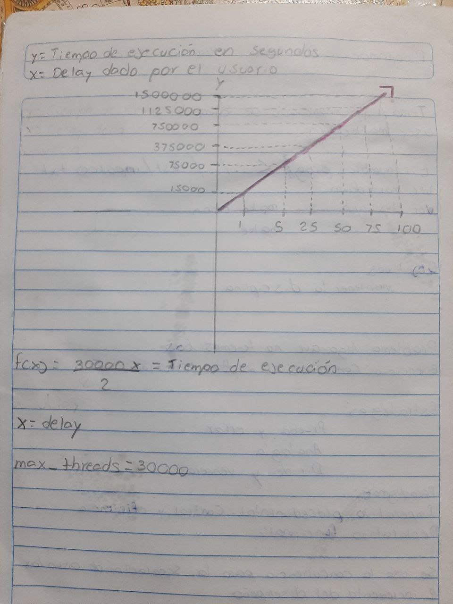

### Hello_order_busywait

## Codigo del Ejercicio # 12 

**Discucion de resultados:**

**Si bien es cierto que el agregar un sleep dentro del codigo evita que el programa caiga por el esfuerzo excesivo que realizan los CPUs**
**estoy es muy poco efectivo ya que incrementa de manera exagerada el tiempo de ejecucion, en otras palabras, si la maxima cantidad de hilos**
**es 300000 esto debe de ser multiplicado por el delay que el usuario le agrega y luego se divide entre 2, el programa compilara pero si por ejemplo**
**tenemos un delay de 100 segundos, el programa terminara su ejecucion en 1500000 segundos, lo cual es una cantidad exagerada de tiempo que invierte**
**Por lo que se puede decir que aunque arregle el problema que genera la espera activa, crea otro problema igual de caotico que es el incremento del**
**tiempo de ejecucion. Si bien el tiempo maximo de ejecucion fue de 1500000 segundos, uno pensaria que este problema se arregla disminuyendo el**
**delay, pero crea un problema mucho mayor y es que vuelve a aparecer el problema principal de una espera activa que es la sobrecarga de trabajo**
**en la CPU haciendo que todos los programas incluyendo el mismo sistema operativo de la maquina caigan ante este problematico ciclo**

**En conclusion, la espera activa con retraso no es una solucion optima para este tipo de casos, por lo que se recomienda utilizar otros mecanismos**
**de control de concurrencia como lo son el mutex y los semaforos que crean sus propias colas de espera y asi evitan sobrecargar la CPU al 100%**

**Resultados de los tiempos pseudoaleatorios:** 

***Contrastando los valores pseudoaleatorios con los valores constantes no hay mucha diferencia, ya que los dos ponen a dormir el programa en tiempos similares***
***el codigo en pseudoaleatorio tiene la ligera ventaja de que si se tiene suerte, sale un numero mas pequeno y disminuye el tiempo de ejecucion, no obstante tambien***
***puede existir la posibilidad de que al correrlo los sleeps sean muy pequenos ocasionando que la CPU llegue a su 100% de capacidad y la maquina se caiga***

Espera activa con retraso. ¿Se corrige el problema de la espera activa si en lugar de tener un ciclo vacío, se espera un cierto tiempo? Copie su carpeta ejemplos/pthreads/hello_order_busywait a ejercicios/pthreads/delayed_busy_wait. Permita que el usuario pueda invocar su programa dos argumentos de línea de comandos: la cantidad de hilos a crear, y la cantidad de microsegundos a esperar cuando no es el turno del hilo de ejecución.

Espera activa con retraso constante. Si no es el turno de un hilo, éste espera una cantidad constante de microsegundos, algo como:

`// Constant delayed busy waiting: wait until it is my turn`
`while (next_thread < my_thread_id) {`
  `usleep(delay);`
`}`

Recuerde probar la calidad de su código **(sanitizers, linter)**. Luego ejecute al menos tres veces su solución **(sin sanitizers)** con la cantidad máxima de hilos de ejecución que su sistema operativo le permite crear y una espera de 50µs. Escriba en el readme.md del ejercicio la mayor de las duraciones que obtuvo de sus corridas. ¿Hubo una mejora de la espera constante respecto a la espera activa pura?

Espera activa con retraso pseudoaleatorio. Altere su solución al ejercicio para que en lugar de esperar exactamente la cantidad de microsegundos indicada por el usuario, espere por una cantidad pseudoaleatoria de microsegundos cuyo límite es el número indicado por el usuario en el segundo argumento de línea de comandos. Sugerencia: puede usar compilación condicional para implementar esta variación. La espera varía en cada iteración del ciclo de espera activa, algo como:

`// Random delayed busy waiting: wait until it is my turn`
`while (next_thread < my_thread_id) {`
    `const unsigned my_delay = rand_r(&my_seed) % max_delay;`
  `usleep(my_delay);`
`}`

Ejecute al menos tres veces su solución pseudoaleatoria con la cantidad máxima de hilos y un máximo de espera de 50µs. Tome la mayor de las duraciones. ¿Hubo una mejora de la espera pseudoaleatoria respecto a la espera constante?

Comparación de las esperas. ¿Mejora el tiempo de ejecución de los dos tipos de esperas (constante y pseudoaleatoria) si disminuye o incrementa la espera máxima de los hilos? Haga al menos un par de ejecuciones con al menos los siguientes tiempos de espera:

***1µs***

***5µs***

***25µs***

***50µs***

***75µs***

***100µs***

Sugerencia: si hay varios compañeros(as) trabajando el mismo ejercicio en el laboratorio, escojan tiempos diferentes y compartan los resultados. Pueden crear una gráfica en un documento compartido. Agreguen más tiempos de ejecución si hay más de 6 integrantes.

**Cree una gráfica donde el eje-x son las duraciones dadas por argumento al programa. El eje-y son los tiempos de ejecución de los programas. El gráfico tendrá dos series, una para la espera constante y otra para la espera pseudoaleatoria.**

Agregue la gráfica al **readme.md** del ejercicio y una discusión de a lo sumo dos párrafos. Indique cuál fue el mejor tiempo máximo de espera obtenido y los efectos de disminuir o incrementarlo. Conjeture y trate de explicar por qué ocurre este comportamiento. Finalmente indique si la espera activa con retraso es una solución óptima, y en caso negativo, provea una idea que pueda lograr este ideal.

*** La discusion sobre si esta solucion es optima o no esta en el inicio del readme, con respecto a los mejores tiempos estos iban variando dependiendo de la cantidad de delay que hubo uno de mas decentes fue de 2356 segundos y el peor no se sabe con exactitud puesto que duro mas de 2 horas ejecutando el programa y se decidio cerrarlo, por lo que se puede concluir de que los efectos de incrementar el tiempo de delay son muy inefiecientes puesto que dura mucho realizar dicha tarea, por otra parte si se decide utlizar tiempos de delay muy cortos, la maquina puede llegar al 100% de potencia provocando que cierre todo lo que se tenga abierto en la maquina o que se estrope del todo ***