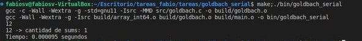

[comment]: <> (Goldbach_serial readme v1.3 Fabio Sanabria Valerin <fabio.sanabria@ucr.ac.cr>)

# Tarea 1

## Planteamiento del problema  

Se pretende encontrar las distintas *sumas de Goldbach* para los diferentes números enteros mayores a 5 ingresados por medio de *la entrada estandar* en el programa, de manera que, para cada uno de los números ingresados se mostrara en la *salida estandar* el número ingresado seguido de la cantidad de *sumas de Goldbach* que existen para dicho número.  

En caso de que el número ingresado posea un signo de menos adelante (-),el programa lo interpretará como **la solicitud de mostrar en lista todas las sumas del número positivo correspondiente**.

## Manual de usuario

Para poder compilar el programa desde la terminal de linux, debe primero abrir una terminal, después d esto debe colocar el comando *cd* seguido del nombre de la carpeta donde se encuentra el programa guardado:  

Una vez colocado en la carpeta correspondiente, si desea obtener las *sumas de Goldbach*, antes debe tomar en cuenta los siguientes aspectos:

1. Ingresar números válidos:  

    El ingresar letras, caracteres especiales ***producirá que el programa detenga su funcionamiento***, asi que si se desea obtener correctamente todas las sumas se recomienda estrictamente ***solo ingresar números enteros***.
    Si ingresa un numero con decimales, el programa le mostrará el resultado del número sin estos (en realidad cierra el programa).

2. Obtener la cantidad de sumas existentes:  

    Para esto, basta con ingresar en el programa el o los números que de los que se desea conocer la cantidad de *sumas de Goldbach* que posee.  
         Ej:  

            8  
            14  
            21  
            *control+d*  

    Basta ingresar el numero, luego apretar la tecla *enter* para ingresar el siguiente numero. Cuando ya no se desea seguir digitando números, debe apretar la tecla *control* más la tecla de la letra d, esto provocará que el programa comience.

3. Ver las sumas obtenidas para el número digitado:

    Si se desea conocer no solo la cantidad de *sumas de Goldbach* sino también cuáles son, se debe digitar un signo menos (-) delante del número del que se desea conocer la suma:

        -9
        -21
        -432
        *control+d*  

4. Digitar varios números:

    Para ingresar una lista de números solo debe *separar cada número por un enter*  de esta manera el programa interpretará que es un número distinto:  

        -7
        65
        -654
        14
        *control+d*  

    Una vez ingresados deberá digitar las teclas *ctrl+d* para que el programa empiece a procesarlos.  
    Una vez finalizado el proceso podrá ver una salida como esta:  

    

5. Ingresar una lista de valores:

    Si desea ingresar una lista debe de escribir el comando de compilación seguido de *"<"* y acontinuació el nombre del archivo con terminación *txt*, de esta manera el programa podrá empezar a prodcesar el archivo que usted desea:

        ./bin/goldbach_serial < ./test/test-small/input001.txt

6. Inicializar el programa para su uso:

    Después de haber leído y tomado en cuenta todo lo anterior, se pude compilar y empezar a correr el programa utilizando las siguientes líneas de código desde la terminal:

        make
        ./bin/goldbach_serial

## Créditos

- Al profesor Jeisson Hidalgo por proveer gran cantidad del codigo de array_int64

- Al profesor Alberto Rojas por dar sus observaciones a la hora de la consulta el 7/9/2022   

- Fabio Andres Sanabria Valerin, creador del programa

Correo para contactar al programador: fabio.sanabria@ucr.ac.cr

### Recursos de terceros utilizados

Adaptación para subrutina calculate_primes() en goldbach.c :  

1. Números Primos y C-Bytes . (2017, 27 de junio). [Video]. Youtube. https://www.youtube.com/watch?v=qRPUkAdc7qE&ab_channel=codigofacilito

Explicacion detallada de la conjetura fuerte de goldbach en C:

1. Goldbach (Problema Omegaup)(C++). (2016, 19 de junio). [Video]. Youtube. https://www.youtube.com/watch?v=sNANHAY1GKQ

Entre otra gran cantidad de ayudas sacadas de Stack overflow -> https://stackoverflow.com/

1. Como el error de double free o lectura de memoria ya eliminada