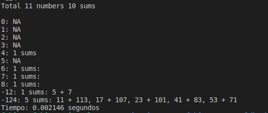

[comment]: <> (Goldbach_pthread readme v1.4 Fabio Sanabria Valerin <fabio.sanabria@ucr.ac.cr>)

# Tarea 2

## Problema a resolver  

Se pretende encontrar las distintas *sumas de Goldbach* utilizando distribución de hilos para los diferentes números enteros mayores a 5 (excepto el 4)ingresados por medio de *la entrada estandar* en el programa, de manera que cada hilo que sea creado se encargará de procesar cada uno de los números ingresados, estos se mostrarán en la *salida estandar* seguido de la cantidad de *sumas de Goldbach* que existen para dicho número. Ademas se han arreglado varios de los aspectos que menciono el asistente en la entrega anterior, no obstante, por falta de tiempo no se pudo realizar una de las recomendaciones que era dividir el goldbach en una calculadora ya que daba varios errores raros y se queria apegar mas al estilo de la tarea 1.

En caso de que el número ingresado posea un signo de menos adelante (-),el programa lo interpretará como **la solicitud de mostrar en lista todas las sumas del número positivo correspondiente**.

## Manual de uso  

Para poder compilar el programa desde la terminal de linux, debe primero abrir una terminal, después de esto debe colocar el comando *cd* seguido del nombre de la carpeta donde se encuentra el programa guardado:  

Una vez colocado en la carpeta correspondiente, si desea obtener las *sumas de Goldbach*, antes debe tomar en cuenta los siguientes aspectos:

1. Ingresar números válidos:  

    El ingresar letras, caracteres especiales ***producirá que el programa detenga su funcionamiento***, asi que si se desea obtener correctamente todas las sumas se recomienda estrictamente ***solo ingresar números enteros***.
    Si ingresa un numero con decimales, el programale mostrará el resultado del número sin estos.

2. Obtener la cantidad de sumas existentes:  

    Para esto, necesitará ingresar el numero de hilos que desea que se creen, después basta con ingresar en el programa el o los números que de los que se desea conocer la cantidad de *sumas de Goldbach* que posee.  

    En caso de que no se ingrese el numero de hilos, el programa usará el numero de cpu's existentes.  

         Ej:  
            Numero hilos:
            5
            Sumas: 
            8  
            14  
            21  
            *control+d*  

    Basta ingresar el numero, luego apretar la tecla *enter* para ingresar el siguiente numero. Cuando ya no se desea seguir digitando números, debe apretar la tecla *control* más la tecla de la letra d, esto provocará que el programa comience.

3. Ver las sumas obtenidas para el número digitado:

    Si se desea conocer no solo la cantidad de *sumas de Goldbach* sino también cuáles son, se debe digitar un signo menos (-) delante del número del que se desea conocer la suma:

        -9
        -21
        -432
        *control+d*  

4. Digitar varios números:

    Para ingresar una lista de números solo debe *separar cada número por un enter*  de esta manera el programa interpretará que es un número distinto:  

        -7
        65
        -654
        14
        *control+d*  

    Una vez ingresados deberá digitar las teclas *ctrl+d* para que el programa empiece a procesarlos.  
    Una vez finalizado el proceso podrá ver una salida como esta:  

    

5. Ingresar una lista de valores:

    Si desea ingresar una lista primero debe colocar el numero de hilos, luego, debe de escribir el comando de compilación seguido de *"<"* y acontinuación el nombre del archivo con terminación *txt*, de esta manera el programa podrá empezar a prodcesar el archivo que usted desea:

        ./bin/goldbach_pthread 5 < ./test/test-small/input001.txt

6. Inicializar el programa para su uso:

    Después de haber leído y tomado en cuenta todo lo anterior, se pude compilar y empezar a correr el programa utilizando las siguientes líneas de código desde la terminal:

        make
        ./bin/goldbach_pthread 8

## Créditos 

- Al profesor Jeisson Hidalgo por proveer gran cantidad del codigo de array_int64

- Al profesor Alberto Rojas por dar consejos de como hacer la tarea

- Fabio Andres Sanabria Valerin, creador del programa

Correo para contactar al programador: fabio.sanabria@ucr.ac.cr
### Recursos de terceros utilizados

Adaptación para subrutina calcular_primos() en goldbach.c :  

1. Números Primos y C-Bytes . (2017, 27 de junio). [Video]. Youtube. https://www.youtube.com/watch?v=qRPUkAdc7qE&ab_channel=codigofacilito

Explicacion detallada de la conjetura fuerte de goldbach en C:

1. Goldbach (Problema Omegaup)(C++). (2016, 19 de junio). [Video]. Youtube. https://www.youtube.com/watch?v=sNANHAY1GKQ

Entre otra gran cantidad de ayudas sacadas de Stack overflow -> https://stackoverflow.com/

## Programador

- Fabio Andres Sanabria Valerin  

    Información de contacto: fabio.sanabria@ucr.ac.cr   