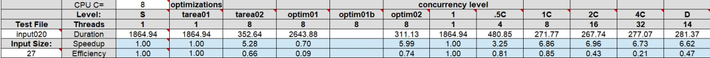
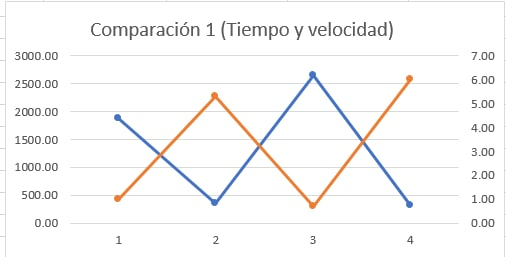
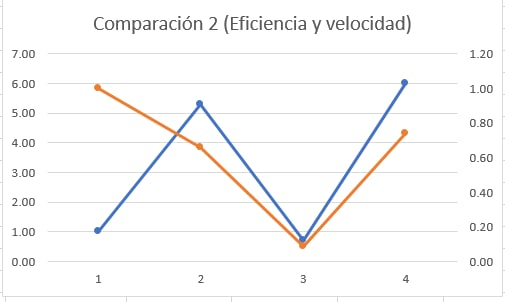
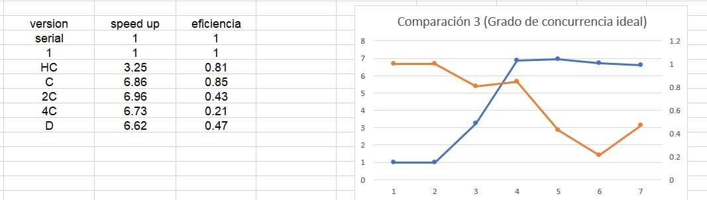
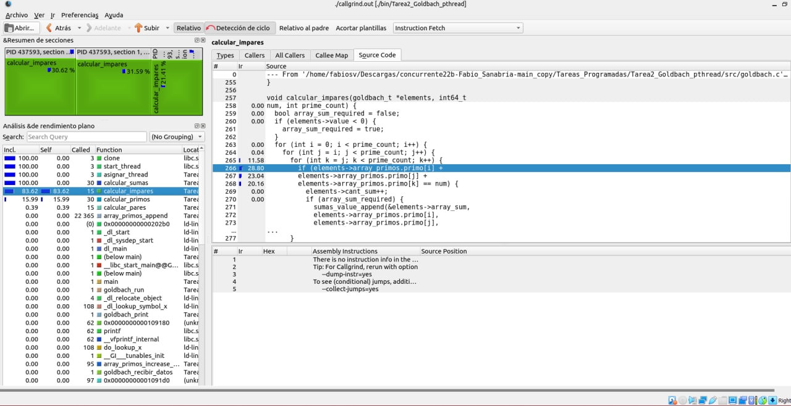
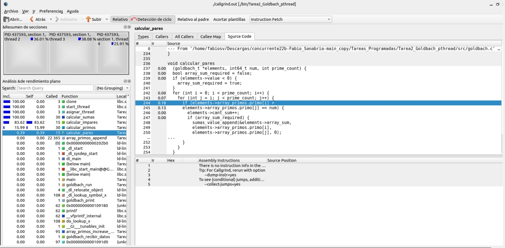

[comment]: <> (Goldbach_pthread readme v1.4 Fabio Sanabria Valerin <fabio.sanabria@ucr.ac.cr>)

# Reporte de tiempos y optimizacion

## Optimización #1: Implementación de mapeo dinámico
  La primera optimización hecha fue la de sustituir el método de mapeo empleado, pasando de utilizar mapeo por bloque a utilizar mapeo dinámico para la repartición de los cálculos entre los hilos. Para este mapeo se utilizaron varias herramientas de control de concurrencia para evitar condiciones de carrera tales como el mutex y su zona critica. Para ello se crean los hilos y llaman a un metodo llamado asignar_thread, dentro de este lo que se hace es crear un while infinito que se detiene hasta que el utlimo numero que haya metido el usuario haya terminado, cuando un hilo termina de analizar un numero inmediatamente se va a analizar otro y asi sucesivamente.

  El tiempo incremento un poco en comparacion a la tarea 2 de pthreads, no obstante todavia se puede conseguir un mejor tiempo de ejecucion, para ello pasaremos a la optimizacion 2.

## Optimizacion #2: Calculo de primos usando Cribas:

  Para poder optimizar el calculo de primos se decidio utilizar una formula matematica llamada Criba de Eratóstenes, la cual itera por un vector de booleanos del tamaño del numero ingresado y va marcando todos aquellos numeros que son divisibles por 2, 3, 5,... y asi sucesivamente para que luego agarrar los numeros que no estan marcados por el vector de booleanos

  **[CODIGO DE ANTES]**:
  
        int calcular_primos(array_primos_t* array_primos, int64_t num) {
        int cont2 = 0;
        // inicio subrutina que busca los primos y los mete en un array
            for (int m = 1; m < num; m++) {  // crea los numeros a ser probados
              int contador = 0;
              for (int j = m; j > 0; j--) {  // revisa si es un numero primo
                if (m % j == 0) {  // si es primo entra e incrementa el contador
                  contador++;
                }
              }
              if (contador == 2) {
                array_primos_append(array_primos, m);
                cont2++;
                // introduce el numero primo
                // en el array de numeros primos del hilo
              }
            }
            // fin de subrutina
        return cont2;
        }

**[CODIGO DE AHORA]:**

      int calcular_primos_calculadora(array_primos_t* array_primos,
      array_booleans_t* array_booleans, int64_t num) {
        int cont2 = 0;
        array_booleans_append(array_booleans, 0);  // 0
        array_booleans_append(array_booleans, 0);  // 1
        
        for (int64_t i = 2; i < num; i++) {
          array_booleans_append(array_booleans, 1);
        }
        // 0 significa que es primo, 1 significa que no es primo 
        //Recorrer los números y para cada uno
        for (int64_t i = 2; i < num; i++){
        //Si es primo recorrer los múltiplos y marcarlos como no primo
          if (array_booleans->boolean[i] == 1) {
            for (int64_t j = i * i; j < num; j += i){
              array_booleans->boolean[j] = 0;
            }
          }
        }
          for (int64_t i = 2; i < num; i++) {
            if (array_booleans->boolean[i] == 1) {
              array_primos_append(array_primos, i);
              cont2++; 
            }
        }
        return cont2;
      }

## Optimizacion #3 Eliminacion de 1 ciclo en cada conjetura

  La tercera y utlima optimizacion que se hizo fue eliminar 2 ciclos, 1 en la conjetura fuerte y otro en la conjetura debil, ademas se creó un buscador de primos lo mas optimizado posible para que evite incrementar el tiempo mas de lo necesario. Para eliminar el ciclo se tuvo que cambiar un poco la manera de buscar los numeros goldbach, ahora en lugar de iterar hasta encontrar una coincidencia se agarra un numero primo y se le resta al numero que le queremos sacar las sumas, si el numero resultante es primo entonces es considerada una suma goldbach y se guarda al vector
  
## Comparacion de optimizaciones

En el siguiente cuadro aparecen las duraciones de cada una de las tareas realizadas, desde la serial hasta la optimizada, y se puede observar que la mas lenta de todas es la optimizada #1 con mapeo dinamico, y se preguntara, ¿Porque si la optimizada usa concurrencia y uno de los mapeos mas poderosos, es la mas lenta?, bueno la respuesta es que la **tarea 1 (Goldbach Serial)** y **tarea 2 (Goldbach Pthread)** fueron optimizadas utilizando **Cribas y reduccion de ciclos** haciendo que el programa sea mucho mas rapido que la optimizacion #1 que solo tiene mapeo dinamico, no obstante esto  cambia cuando llegamos a la **optimizacion #2** que es cuando el mapeo dinamico es acompañado de las optimizaciones seriales, gracias a ellas, la tarea 3 es la mas rapida de todas con diferencia ya que tiene todas las optimizaciones posibles y herramientas que hacen al programa mucho mas rapido. Para lograr ver el comportamiento de cada uno de las tareas optimizadas se utilizo el input020 de los casos medios, el cual es uno de los casos mas extensos que hay y donde se puede comparar mucho mas facil todos y cada uno de los programas. **Nota: Se optimizo la tarea 1 y la tarea 2 ya que el profesor Alberto nos dijo que para comparar los tiempos y evitar que las eficiencias en el cuadro comparativo sean mayores a 1, todas las tareas debian de tener las mismas condiciones optimizadas, es decir, la tarea 1 debia de tener la criba y la disminucion de los ciclos al igual que la tarea 2, entonces se esta comparando la version serial vs concurrencia con mapeo dinamico vs cocurrencia con mapeo estatico**

En la siguiente grafica podemos obsevar el tiempo y la velocidad de todas las implementaciones de goldbach y se puede observar que la mas rapida de todas es la optimizacion #2 y la mas lenta es la optimizacion #1, debido a lo que se explico anteriormente **(La linea azul simboliza el tiempo de las implementaciones y la linea naranja simboliza la velocidad que tiene cada una de las implementaciones realizadas)**

En la siguiente grafica podemos observar un contraste entre la velocidad y la eficiencia de cada algoritmo, podemos tomar a la serial como un punto medio y los demas como variaciones del tiempo y eficiencia, como explico el profesor Jeisson Hidalgo en uno de sus videos, nadie le puede ganar a la version serial en eficiencia ya que es la cuspide de la eficiencia, no hay nada mas eficiente que la serial ya que utiliza todos los recursos que tiene al maximo debido a que todos los procesos los hace un unico hilo, a diferencia de su contraparte concurrente que algunos hilos tienen mas tareas que otros y a veces gastan bastantes recursos. **(La linea azul simboliza el speed up de la implementacion y la linea naranja simboliza la eficiencia que tiene cada una de las implementaciones realizadas)**

Y por ultimo tenemos el grafico 3 que como su nombre nos indica, nos permite observar el grado de concurrencia ideal que necesitamos ya que utilizar muchos hilos no es tan efectivo como mucha gente lo cree, debido a que va a haber un punto en donde no vale la pena gastar tantos recursos por un incremento minusculo de desempeño. Entonces el grafico toma todos los tiempos que dio la tarea 3 optimizada al crear diversa cantidad de hilos y va revisando el speed up y la eficiencia para encontar un punto lo mas equilibrado y beneficioso posible. En este caso, el punto que considero es el mas apropiado para esta tarea es cuando el usuario pide utilizar 8 hilos ya que otorga un incremento de velocidad bastante bueno y la eficiencia es bastante buena en comparacion a otros tiempos que utilizan 12 y 32 hilos.**(La linea azul simboliza el speed up de la implementacion al usar X cantidad de hilos y la linea naranja simboliza la eficiencia que tiene al utilizar X cantidad de hilos)**

## KCachegrind

Como se puede ver en las siguientes imagenes, el kcachegrind nos indica los lugares en donde el programa pasa pegado la mayor parte del tiempo ejecutando procesos, en la **imagen 1 de kcachegrind** se puede ver que calcular_impares consume una enorme cantidad de tiempo por lo que ese metodo se tenia que optimizar, ademas en la **imagen 2 de Kcachegrind** se puede ver que tambien se consume bastante tiempo en el calculo de los primos por lo que ese metodo se tenia que agregar una Criba de Erastostenes para poder aumentar su velocidad y por ultimo se puede observar en la **imagen 3 de Kcachegrind** el calculo de pares, este metodo no es tan ineficiente como los anteriores 2 pero tambien fue modificado para que pueda ser mas rapido que antes 

## Imagen 1 de Kcachegrind

## Imagen 2 de Kcachegrind

## Imagen 3 de Kcachegrind

KCachegrind permite encontrar rápida y visualmente las líneas de código fuente que consumen más recursos de los procesadores, esto nos permite localizar las subrutinas del codigo que necesitan ser pulidas para resucir su tiempo de ejecucion y consumo de recursos.

## Conclusiones Optimizaciones

Despues de haber optimizado cada una de las tareas que hemos tenido a lo largo del semestre, se puede concluir que la optimizacion mas rapida de todas es la de mapeo dinamico con Cribas y eliminacion de 1 ciclo en cada conjetura ya que el mapeo dinamico mantiene a todos los hilos trabajando en varios procesos a la vez decrementando el tiempo de ejecucion de los algoritmos. No obstante, no se debe de menospreciar el mapeo estatico ya que este tipo de mapeo es bastante sencillo de implementar y tambien que tiene un nivel de eficiencia y velocidad equiparable con el mapeo dinamico. Cabe a recalcar que todos los tiempos pueden variar, pero todas las veces en las que se compilo el programa el mapeo dinamico era el mas rapido de todos.
