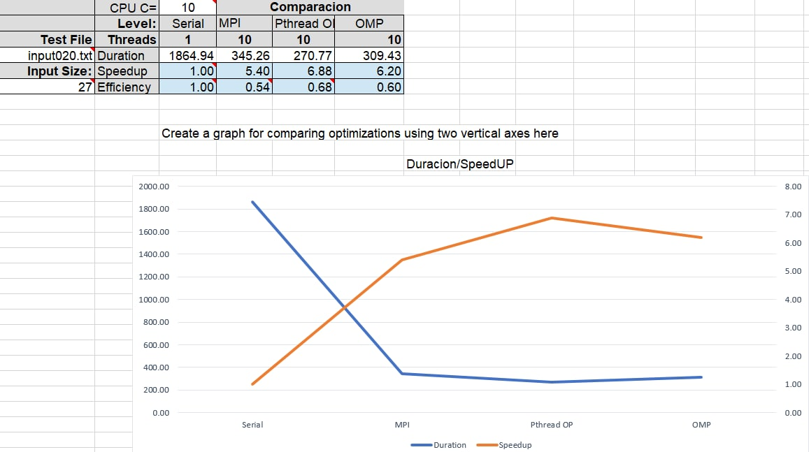
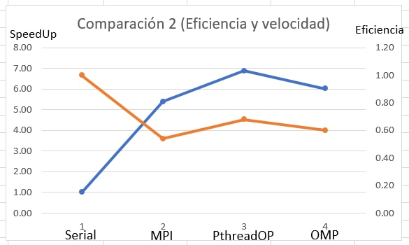
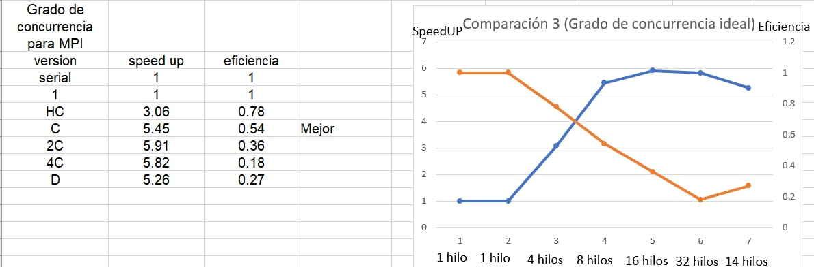

[comment]: <> (Goldbach_Open MP readme v1.5 Fabio Sanabria Valerin <fabio.sanabria@ucr.ac.cr>)

# Reporte sobre tiempos de MPI con OMP

## Notas importantes sobre MPI

Se ha intentado utilizar reiteradamente arenal para las pruebas de la tarea pero da muchos problemas conectarse ya que pasa caido o cuesta mucho conectarse desde casa. Para poder ejecutar el programa de manera correcta se utiliza [**./bin/Tarea4_Goldbach_MPI 10**] siendo 10 la cantidad de procesos que se desean utilizar.

**Al utilizar MPI y OMP los sanitizers no funcionan por lo que puede saltar ese paso**.

**Si al ejecutar sale el Clave MIT-MAGIC-COOKIE-1 inválida, es normal solo hay que ignorarlo y colocar los numeros que se desean sacar las sumas goldbach).**

## Utilizacion de MPI

La interfaz de paso de mensajes (MPI) es un medio estandarizado para intercambiar mensajes entre varias computadoras que ejecutan un programa paralelo a través de la memoria distribuida. Como todas las tecnologias existentes tiene ventajas y desventajas, la principal ventaja es que puede incrementar la velocidad de programas con grandes volumenes de codigo e informacion ya que es mejor dividir una gran cantidad de trabajo en varias maquinas que en una sola. La desventaja de esta tecnologia que es evidenciada en los ejercicios de MPI y la tarea 4 del curso de paralela es que con programas no tan grandes puede mas bien decrementar el desempeño ya que esta inyectando grandes volumenes de codigo a un programa muy simple haciendolo ineficiente.

## Open MP vs MPI

Para continuar con la investigacion de la concurrencia, se realizó una comparación entre OpenMP y Pthreads para ver si es mejor utilizar una solución declarativa o no.
Para esta comparación se usó el caso de prueba input020.txt, ya que este cuenta con un tamaño ni muy pequeño ni muy grande, por lo que se podrá hacer que los hilos trabajen a su maxima capacidad siempre usando el mismo tipo de mapeo. En el siguiente cuadro se mostraran las diferencias de tiempo, velocidad y eficiencia entre la tarea 3 (Pthread Optimizada con mapeo dinamico) y tarea 4 (OMP con mapeo dinamico y las mismas optimizaciones de las anteriores tareas).

|                  | Open MP            | MPI  |
|------------------|------------------|------------------|
|Hilos             | 10               | 10               |
|Tiempo            | 309.43 segundos         | 345.26 segundos         |
|Velocidad         | 6.02            | 5.40             |
|Eficiencia        | 0.60             | 0.54          |

Como se puede ver en el cuadro anterior, MPI es mas lento que OMP, y se pregutara el porque de esta situacion ya que MPI utiliza diversos nucleos de otras maquinas para realizar las pruebas. Bueno la respuesta se ha mencionado anteriormente en el apartado de **Utilizacion de MPI**, este programa al ser un programa tan pequeño si se decide utilizar MPI esta tecnologia inyectara grandes volumenes de codigo haciendo que el programa sea un poco mas lento  de lo normal. Segun el profesor Alberto, este tipo de tecnologias es para programas mucho mas grandes con miles de lineas de codigo como lo puede ser el proyecto 1.2 del servidor goldbach.

A continuacion se mostraran varios graficos comparativos con los diversos tiempos que dieron cada una de las tareas y un grafico con el grado de concurrencia ideal para utilizar MPI:

## [Comparacion de la duracion y velocidad de las tareas]

**Los numeros de la izquierda son los tiempos y los numeros de la derecha son las velocidades**

## [Comparacion de la eficiencia y velocidad de las tareas]

**La linea naranja simboliza la la eficiencia y la azul simboliza la velocidad**

## [Grado de concurrencia ideal del programa de MPI]

**La linea naranja simboliza la la eficiencia y la azul simboliza la velocidad**

Como se puede observar en los anteriores graficos, la velocidad y eficiencia que alcanza MPI es superior a la serial pero es inferior a la optimizacion de la tarea 3 y a OMP ya que como se ha dicho reiteradamente, no vale la pena utilizar una tecnologia de distribucion como lo es MPI en programas muy pequeños ya que requiere de muchos recursos para hacer algo minusculo. Se hicieron varias pruebas y en todas MPI resulto inferior a las anteriores tecnologia. Ademas, se probo utilizando diferentes cantidades de hilos para revisar cual es el mejor grado de concurrencia que alcanza y se llego a la misma conclusion que en OMP, la mejor concurrencia como se puede apreciar en la tercera imagen es utilizando 8 hilos ya que aumenta mucho la velocidad y la eficiencia no baja mucho

[Gráfico de Comparación #4: Comparacion con demás versiones](../design/perf_measure_MPI.xlsx)

## Conclusiones MPI

Esta tecnologia es muy poderosa ya que permite incrementar el desempeño en programas grandes, no obstante, a diferenica de otras tecnologias como lo es pthreads y OMP, esta se le dificulta mucho la parte de la comunicacion entre los hilos por lo que se vuelve muy complicado enviar mensajes al mismo tiempo a diversos hilos entre si a diferencia de las anteriores tecnologias que hemos estado usando en las tareas. Pero eso no le quita el hecho de que puede ser muy buenas para otras circunstancias como lo es en el proyecto 1.2 del curso de paralela o proyectos aun mas grandes.