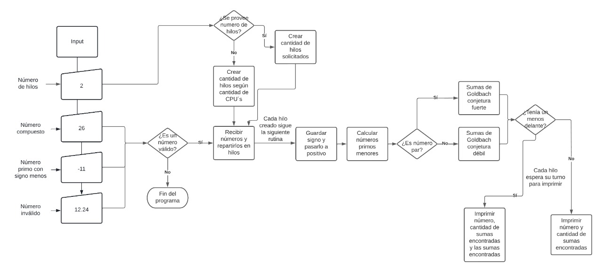
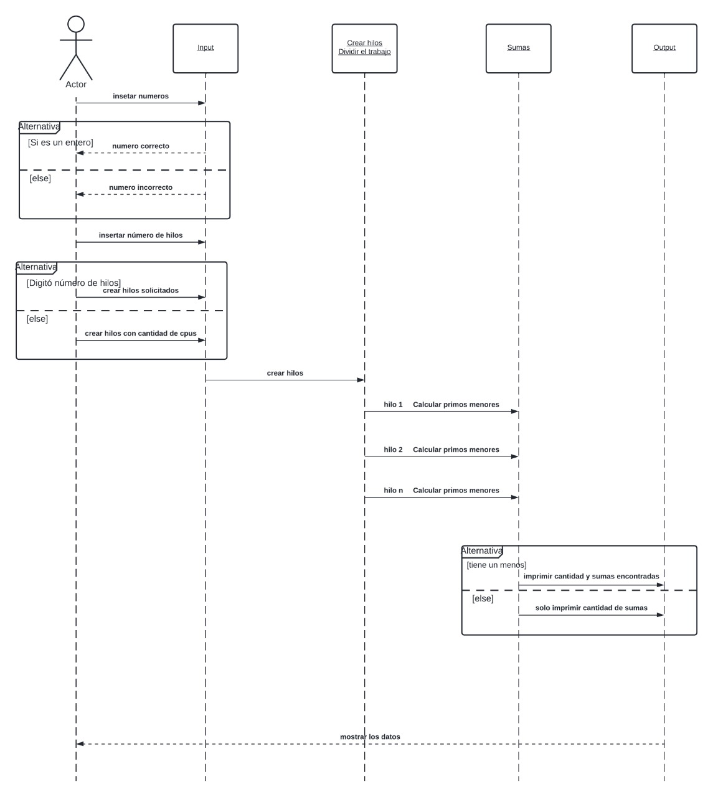
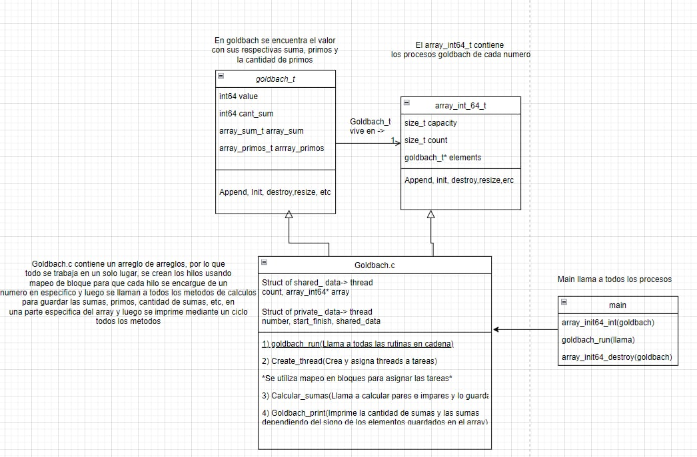

[comment]: <> (Goldbach_pthread readme v1.4 Fabio Sanabria Valerin <fabio.sanabria@ucr.ac.cr>)

# Diagramas del programa

## Diagrama de flujo OMP

En el diagrama mostrado a continuación se muestran las distintas decisiones que debe tomar el programa respecto a los números que ingrese el usuario y los hilos que se creen.  
Se presenta en el diagrama *un número compuesto de al menos dos potencias, un número primo y un número inválido*, esto para ejemplificar con mayor claridad los resultados de las decisiones tomadas de acuerdo al número que reciba el programa **(no hay cambios relevante con respecto a otras versiones)**:

## Diagrama UML secuencial OMP

En el siguiente diagrama se pueden observar los procesos secuenciales ocurridos dentro del programa de manera general, con el fin de brindar mayor claridad a la hora de plantear las etapas necesarias para brindar el resultado deseado al finalizar el programa.  
Se observa al *actor* , quien se encarga de insertar los datos a ser procesados. Luego se muestran los cuatro procesos principales por los que pasan los datos:  

* Entrada de datos o input
* Creacion y division de los hilos
* Realización de las *sumas de Goldbach*
* Salida de datos u output

En caso de que el número digitado no sea un entero el programa se detendrá. En caso contrario se continuará el proceso hasta mostrar la salida de los datos al usuario.

Si el usuario no provee el número de hilos, el programa usará por default la cantidad de CPU's que posea el equipo.  

## Diagrama de clases OMP

El diagrama es el mismo que el de la tarea pasada solo que tiene una diferencia y es que en lugar de crear los hilos utilizando pthread, ahora OMP los crea de manera implicita al llamarlo

## Pseudo Código

[goldbach_optimization pseudo codigo](goldbach_dinamic.pseudo)

## Reporte

[Documento de reporte](../report/Readme.md)
