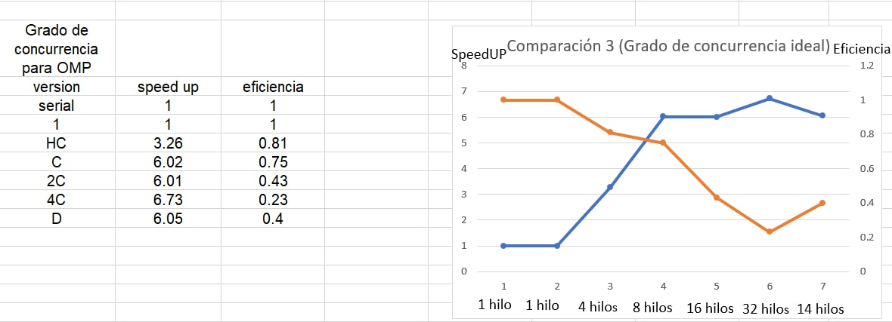

[comment]: <> (Goldbach_Open MP readme v1.5 Fabio Sanabria Valerin <fabio.sanabria@ucr.ac.cr>)

# **Reporte sobre tiempos de OMP**

## Retroalimentacion de tareas anteriores

En anteriores tareas se utilizaron diversos algoritmos para poder crear una calculadora capaz de realizar sumas goldbach de una amplia lista de numeros dada por el usuario, no obstante, varios de esos algoritmos eran muy ineficientes como es el caso del calculo de la conjetura debil y de la conjetura fuerte y tambien la busqueda de los numeros primos como se puede observar en las siguientes imagenes de Kcachegrind

## Imagen 1 de Kcachegrind

## Imagen 2 de Kcachegrind

## Imagen 3 de Kcachegrind

Lo primero que se quizo hacer es utilizar las ventajas de la concurrencia para decrementar la duracion del programa lo cual fue un exito pero aun faltaba mas por optimizar, despues de eso se hicieron varias mejoras al programa como la utilizacion de una criba para incrementar la velocidad de nuestro programa y tambien la reduccion de varios ciclos utilizados dentro del calculo de sumas, ademas se utilizo un mapeo dinamico para incrementar el desempeño.

**La tarea 1 es la tarea Serial sin ninguna optimizacion**
**La tarea 2 es la tarea que usa concurrencia con pthreads y mapeo estatico**
**La tarea 3 es la tarea que usa concurrecia con pthreads, usa mapeo dinamico y tiene todas las optimizaciones seriales anterior comentadas**

Con esto comentado podemos proceder a explicar lo que se hizo en la tarea 4

## Utilizacion de OMP

OMP es una libreria para programacion paralela de caracter declarativo que ayuda a disminuir grandes volumenes de codigo en unas pocas lines y directivas. Esta libreria fue usada en esta utiliza entrega para poder analizar si ella incremeta el desempeño de nuestro programa, si lo mantiene igual o si lo empeora. Para ellos corrieron las tareas 1 optimizada, tarea 2 optimizada, la tarea 3 optimizada y la tarea 4 para poder comparar los resultados y ver el desempeño de cada uno de ellos. Los cambios de la tarea 4 con respecto a la tarea 3 son bastante notables ya que la tarea 3 tenia muchas lineas de codigo para asignar las tareas a diferentes hilos. Todo eso fue reduccido gracias a la libreria de OMP

## Open MP vs Pthreads

Para continuar con la investigacion de la concurrencia, se realizó una comparación entre OpenMP y Pthreads para ver si es mejor utilizar una solución declarativa o no.
Para esta comparación se usó el caso de prueba input020.txt, ya que este cuenta con un tamaño ni muy pequeño ni muy grande, por lo que se podrá hacer que los hilos trabajen a su maxima capacidad siempre usando el mismo tipo de mapeo. En el siguiente cuadro se mostraran las diferencias de tiempo, velocidad y eficiencia entre la tarea 3 (Pthread Optimizada con mapeo dinamico) y tarea 4 (OMP con mapeo dinamico y las mismas optimizaciones de las anteriores tareas).

|                  | Pthread Optimizado| Open MP  |
|------------------|------------------|------------------|
|Hilos             | 10               | 10               |
|Tiempo            | 270.77 segundos         | 309.43 segundos         |
|Velocidad         | 6.88            | 6.02             |
|Eficiencia        | 0.68             | 0.60          |

Como se puede observa en el anterior cuadro, la velocidad no incremento al utiizar OMP, esto puede ser a que OMP utiliza mas directivas y levanta una gran variadad de procesos por debajo que hace que el programa sea mas lento y menos eficiente que la de PthreadsOP ya que en la de Pthreads solo se levantan los procesos que nosotros queramos y programemos, a diferencia del OMP que inicializa diversos procesos que quizas nunca utilicemos.

Un ejemplo que nos dio el profesor Alberto para comparar estas 2 tecnologias es la clase vector, si una persona realiza un programa con la clase vector y otro crea su propia clase vector con los metodos que se utilicen en el programa, la segunda version va a ser mas rapida ya que el programa no tiene que levantar otros metodos e instancias inecesarias.

A continuacion se mostraran varios graficos comparativos con los diversos tiempos que dieron cada una de las tareas y un grafico con el grado de concurrencia ideal para utilizar OMP:

## [Comparacion de la duracion y velocidad de las tareas]

## [Comparacion de la eficiencia y velocidad de las tareas]

## [Grado de concurrencia ideal del programa de OMP]

Como se puede observar en los anteriores graficos, la velocidad al usar OMP es superior a la tarea de de pthreads con mapeo estatico pero es inferior a la tarea 3 de optimizacion con mapeo dinamico debido a lo mencionado anteriormente. Ademas, se puede observar en el tercer grafico que el grado de concurrencia ideal en el programa de OMP es cuando se decide utilizar 8 hilos ya que incrementa bastante la velocidad y la eficiencia no baja mucho, tambien se puede utilizar la mitad de los hilos que son e incrementar la eficiencia pero el incremendo de velocidad sera mucho menor que al utilizar 8 hilos

[Gráfico de Comparación #4: Comparacion con demás versiones](../design/perf_measure_tarea04_OMP.xlsx)

## Conclusiones OMP

Esta es una tecnologia muy interesante ya que como se ha mencionado reiteradamente disminuye una gran cantidad de trabajo y lineas de codigo, haciendo el codigo mas compacto y facil de comprender para otra persona. No obstante, esta tecnologia declarativa tiene la desventaja de que ***no se pueden utilizar los sanitizers*** para poder verificar si esta bien o no el codigo ya que en todos los ejercicios el tsan siempre marca falsos positivos, ademas de que es un poco mas lenta que utilizar los pthreads